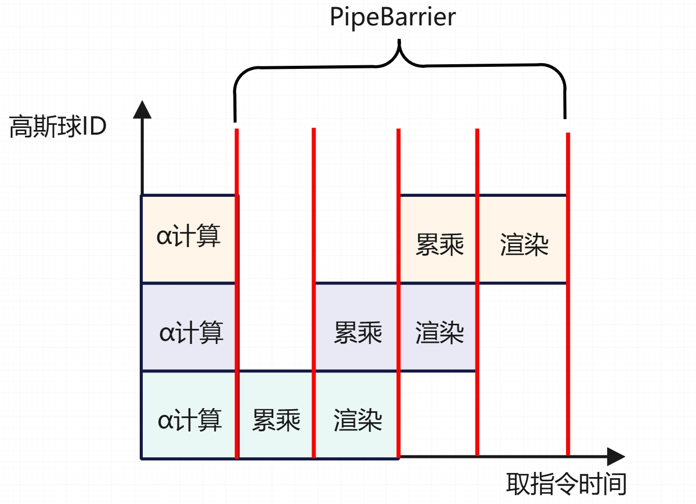
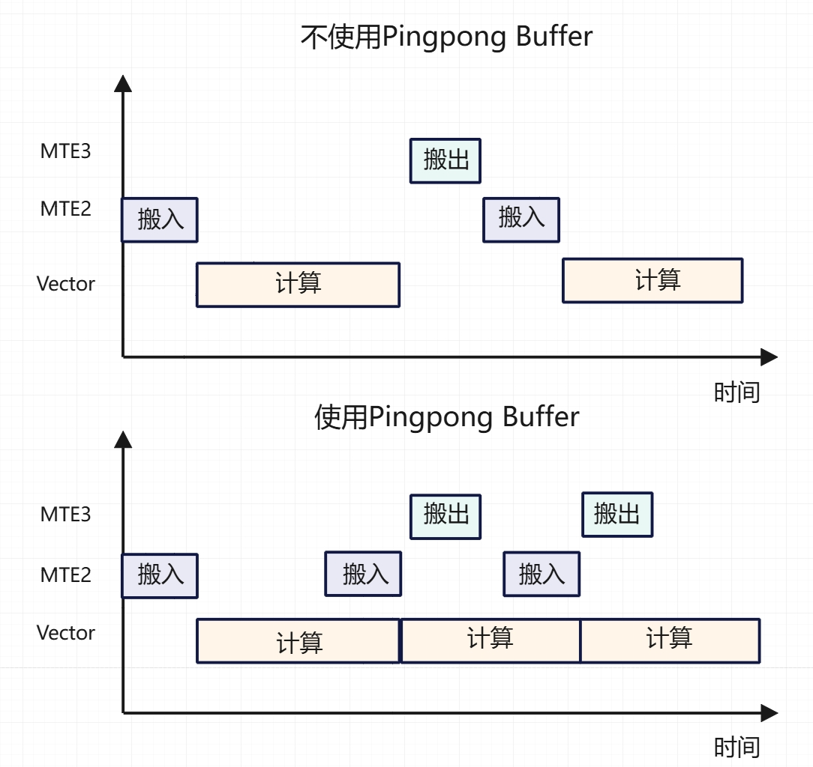
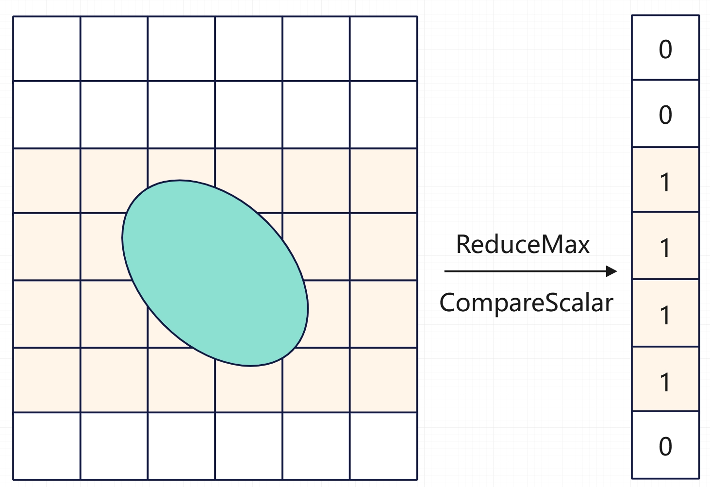

# NPU 3DGS Ascend C Alpha Blending 算子优化

针对 SIMD 计算架构，我们对比GPU实现的3DGS算法需要做相应的特殊优化，本篇文档就其中的`CalcRender`算子上的优化进行具体的阐述，主要包括3DGS渲染流程的介绍、pipeline流水优化和剪枝设计三个部分

## Highlights
- 充分利用硬件特性，基于 Ascend C API 高效实现，SIMD架构下的3DGS算法实现
- 细致的 Pipeline 流水设计，发挥融合算子优势
- 对整个tile的高斯球剪枝处理，提前结束渲染流程
- 基于SIMD特性，对单高斯球的像素高效剪枝操作

### 3DGS Alpha blending 算子流程

Alpha blending 操作是3DGS光栅化过程中的核心步骤，给定一个特定的相机视角和对应的投影平面，将空间中的3D高斯球颜色表达渲染到各个像素上，从而构建成对应视角的渲染图像。Alpha blending具体的计算公式如下：
$$
C = \sum_{i \in N} c_i \alpha_i \prod^{i-1}_{j=1}(1-\alpha_j)
$$
$$
\alpha_i = o_i \exp(-\frac{1}{2} \delta ^ T * \Sigma * \delta)
$$

整体算法流程如下：

1. 按tile对vector core进行切分，每个核循环渲染被分配到的tile上的所有像素
2. 由于累乘操作的存在，必须保证对高斯球进行排序后依次渲染，所以for循环遍历每个高斯球进行渲染
3. 对每个高斯球，并行计算其对tile上所有像素的影响，计算出alpha值和颜色贡献
4. 对每个像素位置，更新累积颜色和透明度值

### 3DGS Alpha blending 算法在 SIMD 架构下的实现难点

在 SIMD 架构下实现 3DGS Alpha blending 算法，主要面临以下几个难点：
1. **流水设计复杂**：由于 SIMD 架构的并行计算特性，流水设计需要充分考虑数据依赖和计算顺序，确保各个计算单元能够高效协同工作。
2. **内存访问开销与计算开销相互掩盖**：由于高斯球数量众多，并且对于一个tile的渲染高斯球之间是不连续的，导致内存访问开销较大，影响计算效率。
3. **高斯球冗余计算**：每个高斯球都需要对tile上的所有像素进行计算，导致大量冗余计算，影响整体性能。

### 高斯球流水优化

#### ***指令流水并行***

由于高斯球之间计算以及单个高斯球内部计算的前后依赖特性，在vector指令之间经常需要插入PipeBarrier来保证数据正确性，导致流水效率较低。根据msprof op simulator的仿真结果，对64个float数计算VMuls需要15ns，而对2048个float数计算VMuls所需要的数据并不是计算64个数的32倍，而是只需要51ns，因为其中包含了指令解码和数据预取的开销。针对这一问题，我们对流水进行了细致的设计，尽可能减少PipeBarrier的插入频率，从而提升流水效率。

最开始逐高斯球进行计算的流水设计中，每处理一个高斯球各个步骤的运算之间都需要插入PipeBarrier，导致流水效率较低。经过分析，我们发现可以将多个高斯球中没有依赖的部分计算（即对$\alpha$值的计算）合并在一起，减少PipeBarrier的插入频率。具体来说，我们将每次处理的高斯球数量增加到4个，这样在处理完4个高斯球后再插入一次PipeBarrier，大大减少了PipeBarrier的插入次数，从而提升了流水效率。

为了实现这一优化，我们需要对单个高斯球的计算进行一些调整。具体来说，我们需要将每个高斯球的计算分为两个阶段：第一阶段计算$\alpha$值，第二阶段计算颜色贡献。在第一阶段中，我们可以并行处理4个高斯球，计算它们的$\alpha$值，并将结果存储起来。在第二阶段中，我们再依次处理这4个高斯球，计算它们的颜色贡献，并更新累积颜色和透明度值。可以看到的是，这样所需的UB空间的使用量会增加一些，因为需要存储更多的中间结果，需要仔细的复用UB空间，如在进行颜色渲染时复用前一个高斯球的$\alpha$计算的空间。

### ***Double Buffer优化***

除此之外，另外一个优化手段是使用Double buffer来提前读取高斯球的属性值，从而掩盖内存访问的开销。具体来说，我们可以在处理当前批次的高斯球的同时，提前读取下一个高斯球的属性值，并将其存储在第二块buffer中。这样，在处理下一个高斯球时，就可以直接从已经写好的buffer中读取属性值，避免了内存访问的延迟。

### 高斯球剪枝设计

在3DGS渲染过程中，许多高斯球对当前tile的像素没有贡献，导致大量冗余计算。为了提升渲染效率，我们设计了两级剪枝机制，分别在tile级别和像素行级别进行剪枝。

#### ***Tile级别剪枝***

根据渲染公式，可以发现当累积透明度达到一定阈值时，后续高斯球对像素块的贡献可以忽略不计。因此，我们在渲染过程中引入了tile级别的剪枝机制。当某个tile的累积透明度达到预设的阈值时，我们提前结束对该tile的渲染过程，避免不必要的计算。具体实现上，我们在每次处理完一组高斯球（配合之前的流水优化，这里是处理完四个高斯球后进行阈值检查）后，检查tile的累积透明度是否达到阈值，如果达到则跳出循环，结束渲染。

受限于 SIMD 的计算架构，我们无法对每个像素单独进行剪枝操作，因此只能在tile级别进行剪枝。在阈值检查的时候就需要确保所有像素的累积透明度都达到了阈值，才能结束渲染。

具体实现流程：
1. 使用`CompareScalar`函数将tile上所有像素的累积透明度与阈值进行比较，生成一个掩码。该指令会按位的方式写回掩码，表示每个像素是否达到了阈值。
2. 使用`ReinterpretCast`函数将掩码向量转为64位的整数。方便后续的判断操作。
3. for循环将掩码整数与**UINT64_MAX**进行按位与操作，如果结果相等，说明所有像素都达到了阈值，可以结束渲染。
4. 为了在反向传播过程中正确计算梯度，我们需要记录每个tile终止渲染的高斯球ID。在反向梯度传播时，从终止的高斯球ID开始继续计算梯度，确保梯度计算的正确性。

由于tile级别的剪枝只能在所有像素都满足条件时才能生效，因此其剪枝效果有限。在实验结果分析中，性能收益只有5~10%左右，为了进一步提升渲染效率，我们引入了像素行级别的剪枝机制。

#### ***Sub Tile级别剪枝***

对于Sub Tile级别的剪枝，我们设计了一种基于高斯球影响范围的剪枝方法。具体来说，我们计算每个高斯球在投影平面上的影响范围，如果某个像素行完全位于高斯球的影响范围之外，则该高斯球对该像素行没有贡献，可以跳过对该像素行的计算。但由于 SIMD 架构所需的连续地址计算，我们无法对每个像素行单独进行细粒度的剪枝操作，因此我们采用对像素行进行剪枝的做法。通过分析高斯球的协方差矩阵，我们可以计算出其在投影平面上的影响范围，从而实现像素行级别的剪枝。在实验结果分析中，评估每个高斯球实际只会影响到6x6左右的像素大小，而目前我们预设的tilesize为32x32，因此每个高斯球实际只会影响到tile上20%的像素行。

具体实现流程：
1. 在整个tile上计算$\alpha$值，高斯球在投影平面上的影响范围，确定其覆盖的像素行范围。
2. 使用`WholeReduceMax`函数计算出每个像素行的$\alpha$的最大值。
3. 使用`CompareScalar`函数将每个像素行的最大$\alpha$值与预设的阈值进行比较，生成一个掩码，表示每个像素行是否需要进行渲染计算。
4. 为了高效地判断哪些像素行需要进行渲染计算，我们将掩码向量重新解释为64位整数，并使用位运算来判断每个像素行的状态。首先使用`ScalarCountLeadingZeros`函数计算掩码整数的前导零数量，由于小端存储的特性，第一个1所在的位置实际对应了最后一个需要渲染的像素行。
5. 然后使用`ScalarGetCountOfValue<1>`函数计算掩码整数中1的数量，表示需要渲染的像素行数量。因此我们就可以通过这两个值来确定需要渲染的像素行范围，从而跳过不必要的计算。
6. 为了在反向传播过程中正确计算梯度，我们需要记录每个高斯球实际影响的像素行范围。在UB空间中使用UInt8保存每个高斯球的起始像素行和结束像素行索引。每存储1024个高斯球后，将这些数据写回到GM空间，方便反向传播时读取使用。

### 实验结果分析

我们在一个包含13万个高斯球的场景（实际上经过过滤后需要渲染的高斯球数仅为67917个）上训练了30000个iters，评估了流水优化和剪枝设计对渲染效率的提升效果。在实验中选择的$\alpha$阈值为0.004，不透明度阈值为0.99, 实验结果如下：正向耗时收益约10%，反向耗时收益约30%。

| 优化方法 | PSNR | 前向device耗时(ms) | 反向device耗时(ms) |
| -------- | -------------- | -------- | ------- |
| 无优化   | 25.008          | 4.807    | 18.710   |
| 流水优化 | 25.005          | 4.379    |  17.565   |
| 剪枝优化 | 25.010          | 5.101     |  13.141   |
| 流水+剪枝 | 24.974         | 4.495     | 13.107   |

#### 不同$\alpha$阈值对剪枝效果的影响

我们评估了不同$\alpha$阈值对剪枝效果的影响(仅评估，没有重新训练)，实验结果如下：阈值提高对反向传播过程的收益提升明显，在选取阈值为0.1时，device反向耗时仅为原来的7.5%，而psnr只下降了3.3%

| 阈值选取 | PSNR | 前向device耗时(ms) | 反向device耗时(ms) |
| -------- | -------------- | -------- | ------- |
| 0   | 25.082          | 4.379    | 18.710   |
| 0.004 | 25.009        | 4.495    |  13.107   |
| 0.01 | 24.949         | 4.358     |  11.267   |
| 0.02 | 24.872         | 4.236     | 9.827   |
| 0.05 | 24.672         | 4.130     | 7.937   |
| 0.1 | 24.274          | 3.539     | 1.410   |
| 0.2 | 23.309          | 3.764     | 1.043   |
