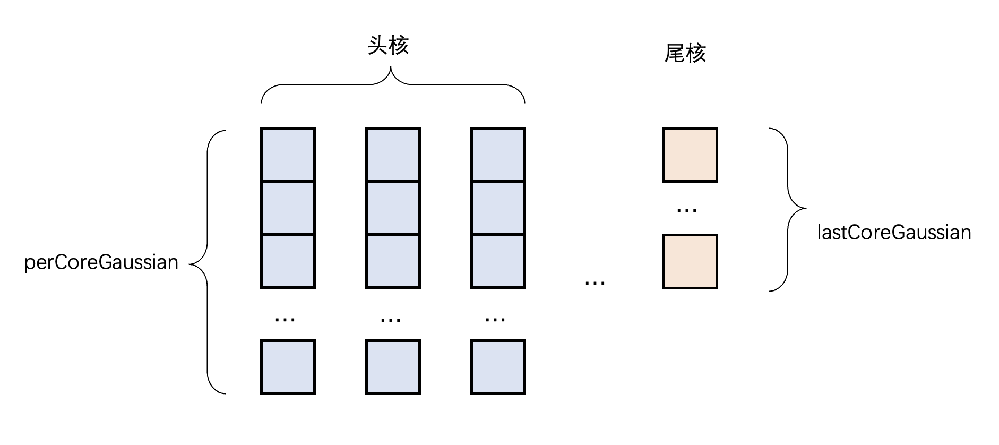
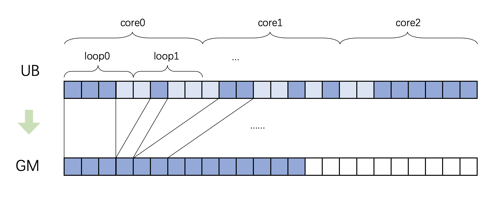
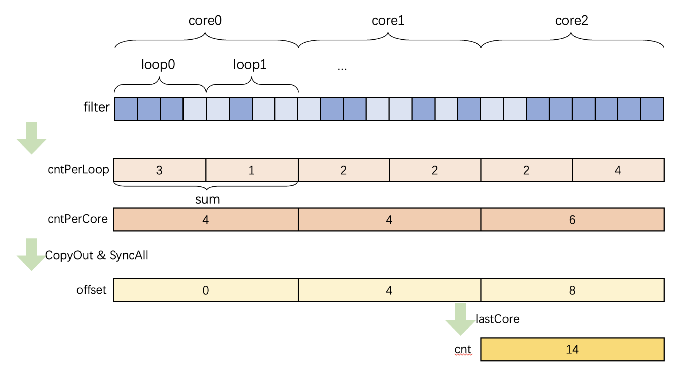
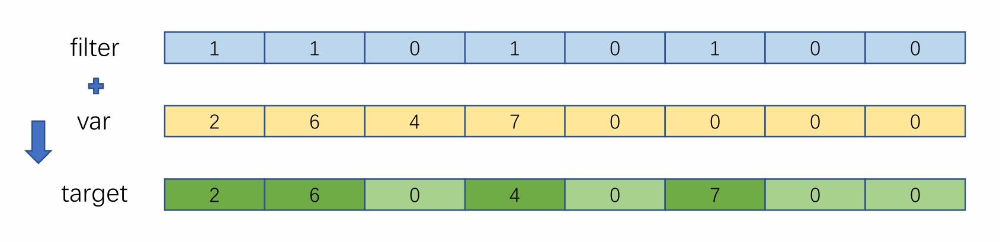
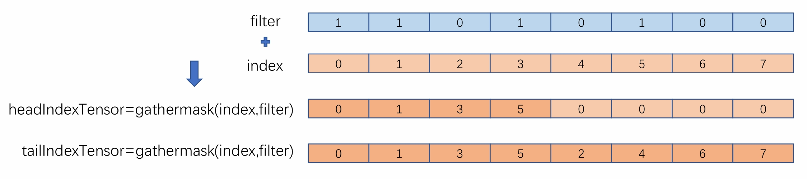
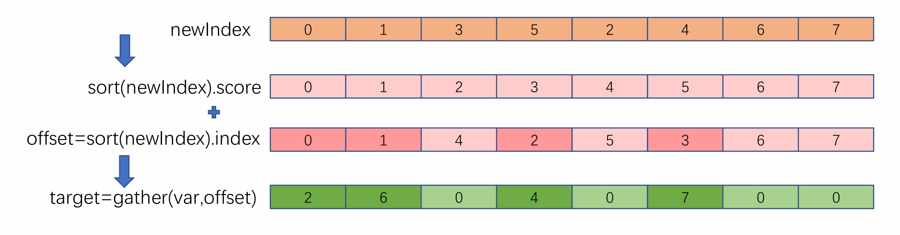
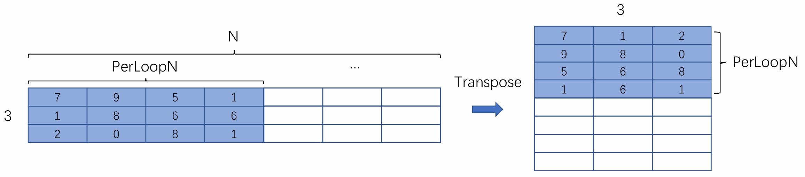

# 视锥剔除优化

## 算子背景
在3DGS中，Culling（剔除） 是渲染前的关键优化步骤，目的是提前过滤掉对当前帧渲染无贡献的 3D 高斯基元，减少后续光栅化、Alpha blending的计算量，大幅提升渲染效率。
它的核心逻辑很简单：只保留 “当前相机能看到” 的高斯，丢弃 “看不到” 的高斯。  
在投影预处理阶段所用的是视锥体剔除，具体逻辑如下：
- 无效高斯剔除：确保高斯是合法的正定矩阵（非退化、非扁平）
- 视锥体深度方向的剔除：剔除深度小于近裁切面（太近）或大于远裁切面（太远）的高斯，只保留视锥体深度范围内的高斯。
- 视锥体水平/垂直方向剔除：剔除高斯投影到屏幕空间后的 2D 椭圆的x/y 方向半径为0的高斯。
- 屏幕外剔除：仅保留 “投影椭圆与屏幕有重叠” 的高斯，剔除完全在屏幕外的高斯。

## 算子实现与优化
算子具体实现与优化分为两步：  
- 实现`GaussianFilter`，将视锥剔除融合为一个算子，避免相当耗时的取index+`tensormove`操作，并返回`filter`，其中比特位为1代表对应高斯有效，比特位为0代表对应高斯无效。
- 投影预处理反向算子计算前，进行反视锥剔除还原出原始Tensor，无效高斯梯度计算中自然置为0

## 实现难点
- 比特位与元素的映射需要对齐：int8类型每个元素可存储 8 个高斯的掩码状态，因此在计算时必须严格保证高斯数据与int8的比特位一一映射。这要求在核内迭代计算时，输入高斯数据的分片必须是 8 的整数倍，否则会出现比特位跨元素映射的混乱，导致掩码判断错误。
- 由于算子的切分涉及核间数据依赖，必须引入全局同步操作，但同步操作会带来性能开销，需要在保证精度正常的情况下，减少全局同步的次数。
- 反向操作的核心是将过滤后的数据分散还原到原始位置，核心难点在于对于无规则的`filter`构建`GatherMask`的数据分散索引。

### tiling
考虑到高斯数量普遍为十万以上，因此在tiling阶段并不对batchsize和相机数进行分核，而是对高斯进行分核。  
具体tiling需要考虑以下2点：
- filter类型为int8，需要对头核进行8元素对齐。
- 对分核进行8元素对齐后，尾核可能计算出负数，因此需要重新反推使用的核数，再进行尾核计算。  

假设NPU的核数为`coreNum`、高斯总数为`N`、头核处理的高斯数为`perCoreN`、尾核处理的高斯数为`lastCoreN`，分核计算如下：
$$
perCoreN = \left \lceil \left \lceil N / coreNum \right \rceil / 8 \right \rceil \cdot 8
$$
$$
usedCoreNum = \left \lceil N / perCoreN \right \rceil
$$
$$
lastCoreN = N - usedCoreNum \cdot perCoreN
$$

### kernel

#### 2.2.1 GaussianFilter
`GaussianFilter`中kernel部分主要考虑的点是分核计算完后的搬运到GM上时的偏移计算。  

#### 偏移计算
 
因为UB大小限制，每个核一次迭代中无法过滤出所有有效高斯，因此这里引入两个变量：
- 假设第$i$个核（$i$取值从$0$到$usedCoreNum-1$）计算出来的有效高斯数量为$cntPerCore_i$ 
- 假设第$i$个核的第$j$次迭代（$j$取值从$0$到$loopN_i$，$loopN_i$取决于UB大小）计算出来的有效高斯数量为$cntPerCore_{i,j}$

那么就能计算出第$i$个核的第$j$次迭代中，需要把计算结果搬运出去的偏移为：
$$
offset = \sum_{k=0}^{i-1}{cntPerCore_i} + \sum_{k=0}^{j-1}{cntPerCore_{i,k}}
$$

#### 计算流程
显然第$i$个核的计算偏移依赖于第$0$到$i-1$核的计算结果，而所有的核又是同步计算的，无法一次直接算出每次迭代的偏移  
因此这里使用`SyncAll`同步分阶段来实现Culling的分核计算。
- Phase1：
首先执行$loopN$次循环迭代，在每次迭代中，先完成`filter`的搬入、计算与搬出；同时统计当前迭代内cnt结果的累积值，将核内迭代计数数组`cntPerLoop`，并同步更新核内总计数`cntPerCore`。待该阶段循环结束后将`cntPerCore`存入位于`workspace`上的暂存空间，执行全局同步操作（`SyncAll`）以确保所有计算核完成第一阶段计算，随后更新并迁出GM上的输出偏移量（`coreOffset`）；仅当当前计算核为最后一个核时，执行全局计数的汇总计算并将最终计数结果迁出至GM上。

- Phase2：
将计算出的`filter`重新搬入，再次执行$loopN$次循环迭代，在每次迭代中，依次搬入需要进行视锥剔除的输入，以`filter`作为`mask`使用`GatherMask`执行视锥剔除，随后结合第一阶段得到的核间偏移量（`coreOffset`）与对应迭代的核内计`cntPerLoop`），确定数据迁出的全局内存偏移地址。使用3个`TQue`保证MTE2、Vector、MTE3流水可以同步进行。

#### 反向梯度还原与数据搬运
#### Scatter实现
本算子的反向处理需将过滤后的数据恢复到原来位置，需要进行数据分散操作。为了避免通过循环+标量计算带来的较长耗时，本算子使用`GatherMask`、`Sort`、以及`Gather`等多API结合的方式实现数据分散的优化。根据`cntPerLoop`对齐的`Filter`的掩码进行恢复，恢复的目的数据分散如图：

- Phase1：实现新的索引构建，用于`Sort`接口排序。操作为先构造与待处理元素等长的元素索引`Index`(0,1,...,`cntPerLoop`)，通过`GatherMask`接口对`Filter`的比特位为1的元素进行`Index`收集，存入头核`headIndexTensor`；再对`Filter`的比特位为0的元素进行Index收集，存入尾核`tailIndexTensor`。将两者拼接得到新的、用于`Sort`排序的索引`newIndex`。由于Tensor操作都需要32字节对齐，拼接实现时需注意对齐问题，这里采用的是先将两部分拷贝到GM上连续的地址，再重新拷贝到UB上。

- Phase2：通过`Sort`接口排序，通过`gather`实现数据重排恢复。`Sort`接口对`newIndex`排序后得到排序值`score`以及每一个`score`对应的`Sort`前所在的位置索引。`Sort`接口提供`Extract`接口实现排序值和排序索引的分离，这里得到的索引正是用于`gather`进行元素收集的取元素地址偏移。在具体实现时，还需注意`Sort`接口只支持降序排序，需构造等差数列对`Extract`得到的索引再重排，得到升序排序索引。

#### 数据搬运优化
数据在`LocalTensor`以N维度切分处理，搬运至`GlobalMemory`上，在计算时，为方便vector运算，将高斯球维度放到Tensor的最后，而为了得到原本输入的梯度的真实shape，数据输出要求改变最后一维和倒数第二维的顺序。  
以维度是`(B,3,N)`的数据搬运成维度是`(B,N,3)`为例：在进行数据切分后的UB上的shape为`(3, perLoopN)`原本需要构造形如[0, perLoopN, perLoopN * 2, 1, 1 + perLoopN, 1 + perLoopN * 2, ...]的index，然后使用`GatherMask`收集对应索引的数据，而构建index需要大量Scalar运算，性能较差。因此，这里使用`Transpose`接口搬运替代构造index的搬运进行优化，思路如下图：

