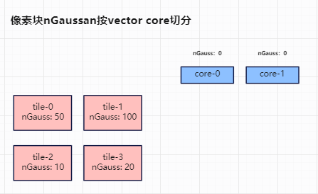
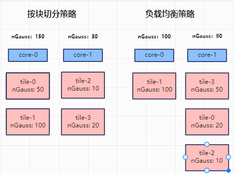
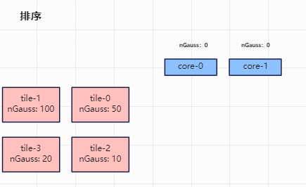
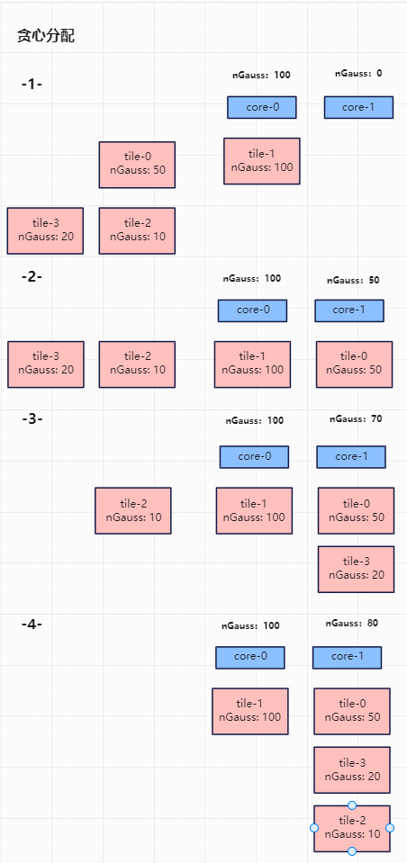

# NPU 3DGS Ascend C Alpha Blending算子负载均衡策略

针对 SIMD 计算架构，我们对比GPU实现的3DGS算法需要做相应的特殊优化，本篇文档就针对每个像素块投影的高斯球数量分布差异较大，导致按像素块切分会导致负载不均问题，引入负载均衡策略，从而提升整体渲染效率。

## Highlights

- 基于SIMD特性，采用通用的按像素块均匀切分策略，无法感知像素块具体计算量，冗余导致个别core拖尾，采用贪心算法进行负载分配，使得每个core负载接近。

### 3DGS Alpha blending 算子流程

Alpha blending 操作是3DGS光栅化过程中的核心步骤，给定一个特定的相机视角和对应的投影平面，将空间中的3D高斯球颜色表达渲染到各个像素上，从而构建成对应视角的渲染图像。Alpha blending具体的计算公式如下：
$$
C = \sum_{i \in N} c_i \alpha_i \prod^{i-1}_{j=1}(1-\alpha_j)
$$
$$
\alpha_i = o_i \exp(-\frac{1}{2} \delta ^ T * \Sigma * \delta)
$$

整体算法流程如下：

1. 按tile对vector核进行切分，每次调用渲染一个tile上的所有像素块
2. 由于累乘操作的存在，必须保证对高斯球进行排序后依次渲染，所以for循环遍历每个高斯球进行渲染
3. 对每个高斯球，并行计算其对tile上所有像素块的影响，计算出alpha值和颜色贡献
4. 对每个像素块，更新累积颜色和透明度值

### 3DGS Alpha blending 算法在SIMD架构下采用负载均衡策略进行切分

在开源GPU实现中，硬件支持Warp级别调度，无需额外负载均衡策略。但在SIMD架构下实现3DGS Alpha blending算法，采用按像素块对vector core进行均匀切分。由于每个像素块上投影的高斯球数分布差异较大，采用均匀切分像素块策略，可能导致每个core上处理负载不均，造成个别core计算拖尾，导致整体渲染耗时增加。

#### 采用贪心算法进行负载均衡

**目标**：将所有像素块的高斯球分配给固定的vector核上，最终使各vector核的负载尽可能均衡，避免出现“单核过载，多核闲置”的情况。

**策略**：采用贪心算法，遵循“先重后轻，分给最轻”的原则，通过局部最优的选择，以达到全局较优的结果。

**实现流程**：
1. **排序**：按照像素块对应的高斯球数将像素块从大到小进行排序。

2. **贪心分配**：将排序好的像素块，优先分配到当前高斯球数最小的vector核上，以此继续分配像素块，直到将所有像素块分配完。

以如下场景为例进行说明：

四个像素块，每个像素块高斯球数分别为50、100、10、20，分配到2个vector核。

目标如下图：

使用像素块平均切分策略会造成倾斜问题，core-0分配150个高斯球，core-1分配30个高斯球，而使用负载均衡策略，则分配相对均匀，core-0分配100个高斯球，core-1分配80个高斯球。

切分策略结果对比如下图：

负载均衡策略具体处理流程如下：

排序：

先将四个像素块，按照像素块对应高斯球数从大到小进行排序。排序结果依次为tile-1，tile-0，tile-3，tile-2。如下图：

贪心分配：

将排序好的像素块，优先分配到当前高斯球数最小的vector核上。

第一步，分配tile-1，当前core-0和core-1上高斯球数均为0，故将tile-1分配到core-0上，core-0的高斯球数更新为100；

第二步，分配tile-0，当前core-1上高斯球数为0，core-0上高斯球数为100，故将tile-0分配到core-1上，core-1的高斯球数更新为50；

第三步，分配tie-3，当前core-1上高斯球数为50，core-0上高斯球数为100，故将tile-3分配到core-1上，core-1的高斯球数更新为70；

第四步，分配tie-2，当前core-1上高斯球数为70，core-0上高斯球数为100，故将tile-2分配到core-1上，core-1的高斯球数更新为80；

完成所有像素块分配。此时core-0上需高斯球数为100，core-1上需处理高斯球数为80。

具体过程如下图所示：

### 对比实验数据分析

我们在一个包含13万个高斯球的场景（实际上经过过滤后需要渲染的高斯球数仅为67917个），评估了按块均匀切分和负载均衡设计对渲染效率的提升效果。 实验结果如下：正向耗时和反向耗时收益均约23%。

| 优化方法  | 前向device耗时(ms) | 反向device耗时(ms) |
| -------- | ------- | ------- |
| 按块切分  |  5.973  | 15.908  |
| 负载均衡  |  4.599  | 12.223  |