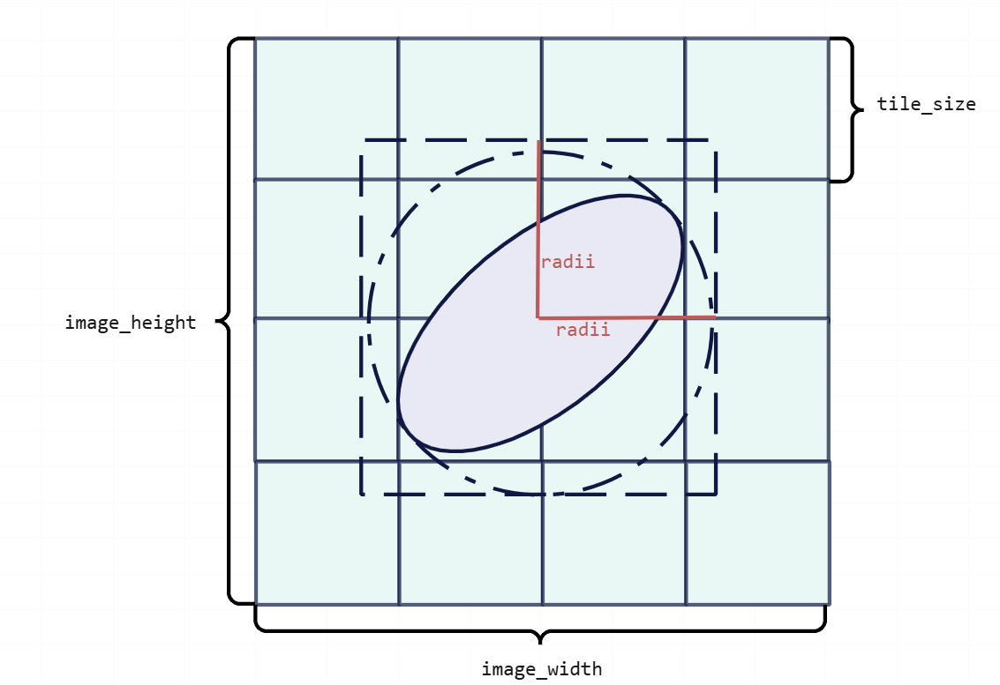
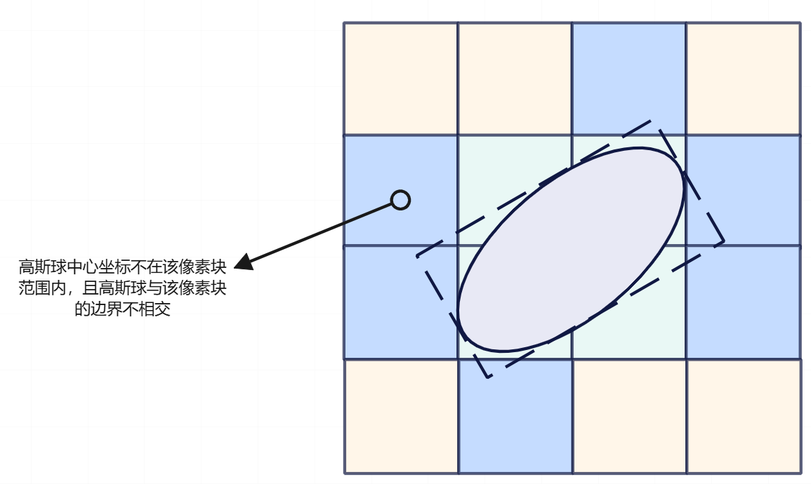
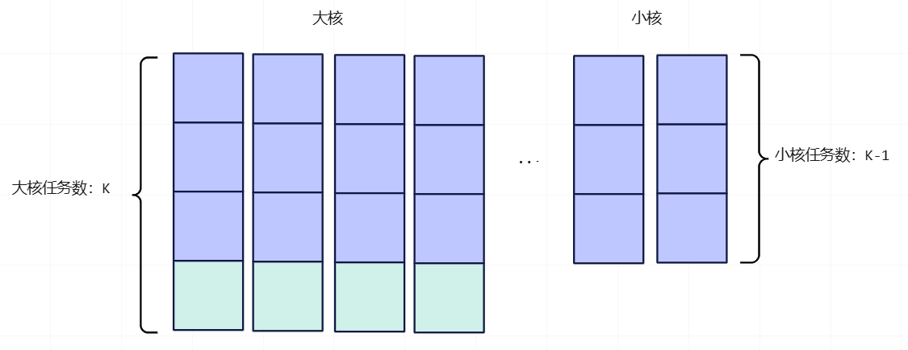
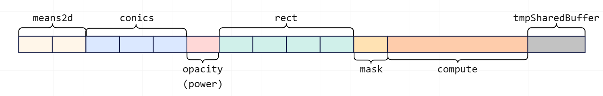
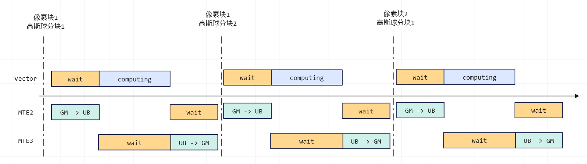
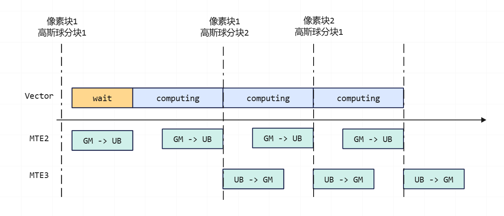
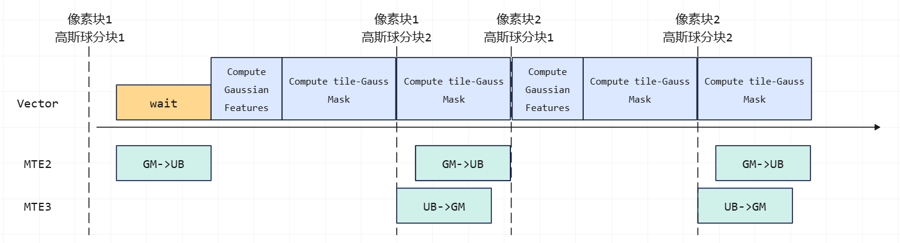

# NPU 3DGS Ascend C Precise Intersection算子优化
## Outline
- [HighLights](#highlights)
- [Precise Intersection算法](#PreciseIntersection算法)
    - [Precise Intersection算子Tiling设计](#PreciseIntersection算子tiling设计)
    - [Vector-MTE流水并行优化](#vector-mte流水并行优化)
    - [计算优化](#计算优化)
    - [性能实验](#性能实验)
- [Citation](#Citation)

## Highlights
Precise Intersection算子用于计算高斯球-像素块映射关系，基于[FlashGS算法](https://arxiv.org/abs/2408.07967)实现，具有以下特点和优势：
- 充分利用硬件特性，实现计算与搬运流水并行，发挥Ascendc硬件优势
- 充分利用AscendC语言特性，优化计算流程，减少重复计算，提升算子性能
- 降低渲染耗时，加速3DGS-Splat训练和推理速度

## Precise Intersection算法
3DGS溅射算法主要包含预处理、排序和渲染等步骤。其中，经过预处理操作后，高斯球的均值与协方差矩阵等由3D球面投影到了2D平面，为了对高斯球进行排序，需要根据高斯球的2D均值、2D协方差矩阵等属性，建立高斯球与像素块之间的映射关系，即相交情况。

假设图像被切分成`M`个像素块，每个像素块的边长为`tileSize`，传统的高斯球-像素块映射关系计算基于以下原理实现：


通常，高斯球在2D平面的投影为椭圆形，假定椭圆的长半径为`Radii`，则传统的高斯球-像素块映射（以下简称为GS）确定了以高斯球投影中心点为圆心，以`Radii`为半径的圆形，从而获得该圆形的正切边界框。如果像素块`m`与边界框有相交面积，则认为高斯球与`m`相交。所有与`m`相交的高斯球都会进行排序，确定该高斯球对`m`像素块的贡献程度，并参与该像素块的渲染。

然而，由于高斯球的2D平面投影为椭圆形，因此使用正切四边形计算高斯球-像素块映射关系的GS算法可能把没有与像素块重叠的高斯球加入排序与渲染，导致计算量增大，渲染效率降低。Precise Intersection算法对GS算法进行了优化，提高了3DGS渲染速度，减少内存开销。与GS算法相比，Precise Intersection算法的优化点主要包含：

- 使用与高斯球2D投影椭圆相切的矩形边界框判断像素块与高斯球的相交关系，如下图所示，Precise Intersection算法的矩形边界框表示比正方形边界框表示更加精准。

- 对于与边界框重合的像素块，判断该像素块是否与椭圆相交。为了降低求解相交问题二次方程的计算成本，Precise Intersection算法将相交问题转化为：判断椭圆在边界框上的投影是否与边界框重叠。

下图为Precise Intersection算法的原理实现：


可以看出，Precise Intersection算法对于高斯球边界框的计算更为精确，且增加了更多相交判断，将没有真正与像素块相交的高斯球剔除到了该像素块的高斯球排序和渲染范围之外，减少了计算量。

Precise Intersection算法的计算流程可拆解为以下步骤：

假设输入高斯球的批次大小为`batchSize`，相机数量为`cameraView`，高斯球数量为`N`，像素块数量为`M`，则每个像素块都需要与全部的高斯球进行映射关系计算。

对每个像素块：
1. 计算全部高斯球相切矩形边界框的顶点坐标
2. 判断全部高斯球边界框是否与像素块相交，计算结果表示为掩码`mask`
3. 判断全部高斯球中心点坐标是否在像素块范围内，计算结果表示为掩码`centerFlag`
4. 判断像素块边界是否与高斯球投影相交，计算结果表示为掩码`intersectFlag`
5. 三个掩码进行与或操作，获得该像素块与高斯球最终的映射关系掩码

### Precise Intersection算子Tiling设计
Ascendc算子在计算时，利用片上UB暂时存储计算数据，由于UB空间有限，因此计算过程需要进行切块。UB存储空间是否被充分利用，决定了算力利用程度及计算效率。本节阐述了Precise Intersection算子的Tiling设计如何充分利用UB存储空间，高效实现核内计算。

Tiling设计包含分核与切块两部分设计。
- 分核设计

分核是指如何将计算任务分配到每个AICore上，让每个AICore并行计算不同的任务。AICore中包含Cube核与Vector核，Precise Intersection算子仅使用了Vector核。

Precise Intersection算子将像素块的个数`M`作为总任务数进行分核。假设NPU的Vector核总数为`blockDim`个，则每个Vector核上平均会分配`M/blockDim`个像素块映射任务。

由于`M`与`blockDim`不一定为倍数关系，所以Precise Intersection算子进一步使用了大小核分核策略，前`n`个Vector核计算`K`个任务，后`blockDim-n`个Vector核计算`K-1`个任务，如下图所示：


- 切块设计

由于在分核时，将像素块数量作为总任务分配给AICore，因此，需要对高斯球进行切块设计，将高斯球分块搬入UB，并与每个核上的像素块分别进行计算，计算完成后搬出UB。

算子Tiling设计将UB的85%作为高斯球搬入、搬出、分块计算的区域，剩余的15%用于临时Buffer存储计算API的临时结果，如下图所示：

采用这样的切块设计，一次切块计算的高斯球数量为2.62K。

### Vector-MTE流水并行优化
通常AscendC算子核内计算的流程为：
1. 将分块数据从GM上搬运到UB中，此时需设置Vector等待MTE2的流水同步，当同步信号完成后，Vector确定MTE2的搬运完成，才能开始进行计算，否则会因搬运数据未完成导致计算出错。

2. Vector核进行计算，此时需设置MTE3等待Vector的流水同步，当同步信号完成后，MTE3才能将UB上的计算结果搬出到GM上。

3. 将计算结果从UB中搬运到GM上，此时需等待MTE2等待MTE3的流水同步，当同步信号完成后，重复1-3步骤。

下图为核内计算流水的示意图：


可以看出，上述计算流程没有进行流水并行，MTE2、Vector和MTE3为线性工作，Precise Intersection算子所计算的像素块数量通常较多，高斯球数量在10万~100万，如果采用这样的线性流水，将会浪费许多时间，降低算力效率。

为了降低算子耗时开销，充分利用昇腾硬件特性，Precise Intersection算子对流水进行了并行优化，如下示意图所示：


优化点主要包含：
-  当前分块计算完成后，MTE3搬出计算结果。由于MTE搬出的数据与下一分块计算的数据是独立的，因此MTE3搬出与下一分块计算并行，减少一次流水同步开销。

- 若当前分块计算是高斯球对Vector核上最后一个像素块进行映射计算，则在当前分块计算过程中同步搬入下一次分块计算所需的高斯球数据，使下一次分块计算的Vector核不必等待MTE2的流水同步，减少一次流水同步开销。

对mipnerf360_v2数据集中的garden场景进行测试，流水并行优化带来的开销收益如下表所示：

| 优化方法 | 前向device耗时(ms) |  收益比例  |
| :--------: | :--------: | :--------: |
| 无优化   | 4.550    |  - |
| 搬出并行 | 4.216     | 7.9% |
| 搬出并行 + 搬入并行 | 3.948     |  6.8% |

与流水并行之前相比，总体开销收益为15.2%。

### 计算优化

从Precise Intersection算法计算步骤的介绍中可以看出，尽管每个高斯球都需要对全部的像素块计算映射关系，但高斯球本身的属性，如2D投影坐标、协方差逆矩阵和不透明度是不变的，因此，如果在每一次分块计算时都搬入对应的高斯球数据，那么会增加不必要的搬入耗时。

因此，在流水并行优化的基础上，进一步对计算进行了拆解，将Precise Intersection的计算过程拆解为高斯球相关特征计算（如计算高斯球的边界框、不透明度对数）和高斯球-像素块映射关系计算，分块计算过程中，首先完成高斯球相关特征计算，然后对每个像素块进行映射关系计算，减少搬入核计算耗时开销。

拆解后的算子流水示意图如下：


此外，在计算过程中，我们还基于AscendC编译器特性、昇腾硬件特点，对计算过程进行了优化。算子的计算步骤有时存在依赖，需要获取上一步的计算结果后，再进行下一步的计算。AscendC编译器会根据代码自动判断是否存在依赖，并在可能存在依赖的代码之间自动插入Vector流水同步。因此，我们对计算过程进行了调整，尽量减少上下文之间的依赖，例如，Precise Intersection算子在计算边界框时的公式为：
$$
w = \lfloor(\sqrt{2 * cov_{00} * power} + 1)\rfloor
$$
$$
h = \lfloor(\sqrt{2 * cov_{11} * power} + 1)\rfloor
$$
常规的计算步骤为依次计算$w$和$h$，但在AscendC算子中，可以同步计算公式中相同或相近的部分：
$$
step1:
w_0 = 2 * cov_{00} * power, 
h_0 = 2 * cov_{11} * power
$$
$$
step2:
w_1 = \sqrt{w_0} + 1, 
h_1 = \sqrt{h_0} + 1
$$
$$
step3:
w = \lfloor w_1 \rfloor, 
h = \lfloor h_1 \rfloor
$$

这类计算优化能够进一步减少算子开销，提升Precise Intersection算子的性能。对mipnerf360_v2数据集中的garden场景进行测试，计算优化带来的开销收益如下表所示：

| 优化方法 | 前向device耗时(ms) |  收益比例  |
| :--------: | :--------: | :--------: |
| 流水并行优化 | 3.948     |  - |
| 流水并行 + 计算拆解 | 3.260    |  21.1% |
| 流水并行 + 计算拆解 + 计算过程调整| 3.116    |  4.6% |

与计算优化之前相比，总体开销收益为26.7%。

### 性能实验
Precise Intersection算法采用比原始GS算法更加精确的相交判断算法，实现了快速高效过滤高斯球的功能。通过对mipnerf360_v2数据集中的场景进行测试，可以看出Precise Intersection算法能够比GS算法剔除更多的高斯球，从而使渲染耗时降低、渲染速度加快。

| 高斯球数量 | 像素块数量 | 映射关系计算方法 | 渲染前向device耗时(ms) |
| :--------: | :--------: | :--------: | :--------: |
| 20w   | 425    |  GS<br>**Precise Intersection** | 8.955<br>**6.671** |
| 40w   | 425    |  GS<br>**Precise Intersection** | 17.499<br>**13.017** |
| 100w   | 425    |  GS<br>**Precise Intersection** | 35.957<br>**22.880** |
| 7w   | 1107    |  GS<br>**Precise Intersection** | 7.783<br>**4.863** |
| 14w   | 1107    |  GS<br>**Precise Intersection** | 15.384<br>**9.489** |
| 28w   | 1107    |  GS<br>**Precise Intersection** | 25.311<br>**15.493** |

## Citation
```bibtex
@misc{feng2024flashgsefficient3dgaussian,
      title={FlashGS: Efficient 3D Gaussian Splatting for Large-scale and High-resolution Rendering}, 
      author={Guofeng Feng and Siyan Chen and Rong Fu and Zimu Liao and Yi Wang and Tao Liu and Zhilin Pei and Hengjie Li and Xingcheng Zhang and Bo Dai},
      year={2024},
      eprint={2408.07967},
      archivePrefix={arXiv},
      primaryClass={cs.CV},
      url={https://arxiv.org/abs/2408.07967}, 
}
```